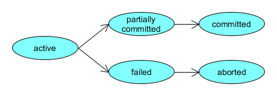
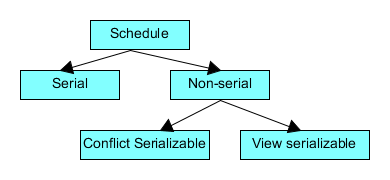

## ACID 

### Atomicity

- *Dataproblem*: En af operationerne i en transaktion fejler

- Systemet garanterer `alt eller intet` - Enten hele transaktionen eller ingenting

### Consistency

- Systemet garanterer at `constrains` er overholdt efter transaktionen

### Isolation

- *Dataproblem*: Operationer fra forskellige transaktioner påvirker hinanden

- Systemet garanterer at transaktioner ikke påvirker hinanden
- Kan løses ved at alle transaktioner afvikles serielt (men giver dårligt performance)

### Durability

- *Dataproblem*: En transaktion bliver markeret som gennemført, men fejler.

- Systemet garanterer at data er persisteret, når man får svar


## Transaktioner

- Serie af operationer udføres samlet

- Tilstand:

  
  Bemærk her, at `Partially commited` er, når alle statements er kørt.

## Samtidige transaktioner/ concurrency

- Flere transaktioner får lov at køre samtidigt
  - Øget disk og processor brug
  - Øget `throughput` - the amount passing through a system from input to output (especially of a computer program over a period of time)
- `Isolation` kræver kontrol systemer
- Hvis en database skal sikre `ACID` skal den sørge for
  - At `schedules` er `conflict serializable`
  - At `schedules` er `recoverble`

## Schedule
- Kronologisk sekvens af operationer
  - Alle operationer fra alle transaktioner
- `Fletning af transaktioner`  - kan give enten `ækvivalente schedules` eller `ikke ækvivalente schedules`




### Serial Schedule

- Transactions are ordered one after the other
- Sikre `ACID`, men giver dårligt performance - særligt med multiple servere

### Non-serial schedule

- Supports concurrency

### Recoverable schedules

- Hvis en operation `B` er afhængig af resultatet af en anden operation `A`, skal `A` være commitet før `B`, ellers risikerer `B` risikerer at læse inkonsistent state

```
Ta	 	Tb
-----  -----
R(X) 	
W(X)  	
        R(X)
        W(X)
        R(X)
commit	
        commit
```

### Cascadeless Schedule
For example, lets say we have two transactions Ta and Tb. Tb is going to read the value X after the W(X) of Ta then Tb has to wait for the commit operation of transaction Ta before it reads the X.

```
Ta	 	Tb
-----    -----
R(X)	
W(X)	
         W(X)
commit	
         R(X)
         W(X)
         commit
```

## Serializability (Serialiserbarhed)

- **bevarer konsistent** database, hvis en schedule er `serialiserbar`, dvs.  hvis den er ækvivalent til en serial schedule
  - Concept that helps us to check which non-serial schedules are serializable
  - `Non-serial schedule` needs to be checked for `Serializability`
  - Identifies data transactions as occurring serially, `independent of one another`, even tough they may have occurred concurrently

### Conflict Serializability

-  `Conflict equivalent` hvis:
   -  To schedules har samme transaktioner
   -  Forskellig rækkefølge af operationer
   -  Men samme resultat 
-  Er en schedule `conflict equivalent` med en `serial schedule` er den `conflict serializable`
-  Flere transaktioner kan køres samtidig, hvis deres `schedules` er `conflict serializable`
-  A `schedule` is called `conflict serializable` if we can convert it into a `serial schedule` after swapping its non-conflicting operations. 
   -  Kan også modelleres som en graf. Er grafen acyklisk er planen confilict serializable
- To check whether a non-serial schedule is `conflict serializable` or not

#### Example of NOT conflict Serializability

Lets consider this schedule:

```
T1         T2
-----     ------
R(A)
R(B)
          R(A)
          R(B)
          W(B)
W(A)
```

To convert this schedule into a serial schedule we must have to swap the `R(A)` operation of transaction `T2` with the `W(A)` operation of transaction `T1`. <u>However we cannot swap these two operations because they are conflicting operations</u>.
#### Example of conflict serializable
```
T1         T2
-----     ------
R(A)
          R(A)
          R(B)
          W(B)
R(B)
W(A)
```

Lets **swap non-conflicting operations**:

After swapping `R(A)` of `T1` and `R(A)` of `T2` we get:

```
T1         T2
-----     ------
          R(A)
R(A)
          R(B)
          W(B)
R(B)
W(A)
```

After swapping `R(A)` of `T1` and `R(B)` of `T2` we get:

```
T1         T2
-----     ------
          R(A)
          R(B)
R(A) 
          W(B)
R(B)
W(A)
```

After swapping `R(A)` of `T1` and `W(B)` of `T2` we get:

```
T1         T2
-----     ------
          R(A)
          R(B)
          W(B)
R(A)         
R(B)
W(A)
```

We finally got a `serial schedule` after swapping all the non-conflicting operations so we can say that the given schedule is **Conflict Serializable**.
### View Serializability
- a process to find out that a given schedule is view serializable or not

#### View equivalent

If they satisfy all the following conditions:

1. **Initial Read**
2. **Final Write**
3. **Update Read**

#### Example

```
Non-serial          Serial
---------           --------
    S1                  S2
T1     T2           T1     T2
---   ---          ---     ---
R(X)               R(X)
W(X)               W(X)
       R(X)        R(Y)
R(Y)                       R(X)
W(Y)                       W(X)
       R(Y)                R(Y)
       W(Y)                W(Y)
```

- S2 is the serial shedule of S1. If we can prove that they are view equivalent then we can say that given shedule S1 is View Serialable

### Implementering af Isolation

- Locking
  - Hele databasen
  - Berørte data
- Hvad med Lock på låsen?
  
  - Prøv at tage låsen og check om det lykkes
- 2 phase locking
  1. Tage alle låse du skal bruge (vent på dem der ikke er ledige)
  2. Udfør transaktion
  3. Frigør alle låse
	- Kan give `Deadlock`


## Concurrency control 

Concurrency control is the procedure in DBMS for managing simultaneous operations without conflicting with each another
https://www.guru99.com/dbms-concurrency-control.html


## Glossary 

### Serial

- means one event at a time

### Parallel/ concurrently/ simultaneously 

- meaning more than one event happening at a time.

### Conflicting operation

- Operations by `different transactions` on the `same data item`, and at least one of these instructions is `write` operation
  - `Create`, `Update` og `Delete` er alle `write`

### Rollback

- Ændringer føres tilbage til før transaktion start

### Cascading rollback

- Afhængige transkationer må også rulles tilbage


## Questions :

- Hvorhenne løser man det med booking system, som du har snakket mange gange? 

> The classic method to do this is to use a transactional database (so there's no clashes) and to do a *tentative allocation* of the seat to you that expires after some length of time (e.g., 10 minutes for kiosks) that gives you enough time to pay. If the (customer-visible) transaction falls through or times out, the seat allocation can be released back into the pool. (All state changes are processed via the transactional database, and one customer-visible transaction might require many database-level transactions.)

- Hvad er navn til`samtidig transkaktioner` på engelsk