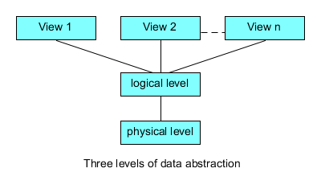

### Database

- organiseret samling af data
- persistent lag af applikation

### Hvad karakteriserer en god database?

- Konsistens - transaktions, integrity constrains 
- Performance - indexes
- Tilgængelighed

### Flade filer

- Filer langsomt, ingen index
- Data redundans og uoverensstemmelse (inkonsisten)
  - samme data gemmes flere steder og opdateres måske ikke samtidigt
  - ingen relationer
- ingen datatyper, ingen normalization, ingen integrity constrain (balance<0)

- ingen transaktioner. Ingen håndtering af samtidige transaktioner

###  DBMS

- Grænseflade, motor

- Eksampler

  - Relationelle: MySQL, PostgreSQL
  - Document store: Mongo
  - Graf: Neo4J

### Hvad repræsenterer de 3 abstranktionslag
- View - præsentation af data.
  - I praksis ofte ersattet af et API
- Logisk/konceptuel 
  - data model 
  - structure and constraints for the entire database
- Fysisk - lagring på disk

### Database motor
- ACID er sikret af database motor
#### Query processor 
  - acts as an intermediary between users and the DBMS data engine in order to communicate query requests
  - When users enter an instruction in SQL language, the command is executed from the high-level language instruction to a low-level language that the underlying machine can understand and process to perform the appropriate DBMS functionality. 
  - optimizes queries to ensure fast processing and accurate results.
  - In other words,  receives as input a query request in the form of SQL text, parses it, generates an **execution plan**, and completes the processing by executing the plan and **returning the results** to the client.
- The **query processor** communicates with the **storage engine**

#### Storage manager/ Storage engine/ Storage system

* Håndterere lagring af data, incl. metadata, statistik
* Står for ACID
* Filsystem

### Arkitektur
#### Master-slave 
- Master for writing
- Slaves for reading
- Slave can be promoted to be master, if the master is down
#### Multiserver
A distributed database is a database in which not all storage devices are attached to a common processor. It may be stored in multiple computers, located in the same physical location; or may be dispersed over a network of interconnected computers
#### Distrubuering P2P,  Block chain
- Hvor man spreder data ud til bruger

