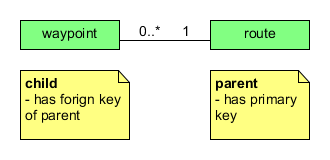

### Design process

- Afdækning af brugerens databehov
- Oversættelse til Logisk Design
  - Entity-relationships 
- Fysisk design

### Afdækning af krav

- Kig på brugerens vision
- Navneordsanalyse
- Use cases
- Krav specifikation

### Logisk design

- Konvertering af abstrakt model til databse model
- Hvilke attribute skal der gemmes?
- Hvordan opdeles data i entiteter og hvordan kobles de?

### Entity relationship model

- **Entities** :  rektangler
  - Et objekt i domænet
- **Relationships** - rhomber
  - Beskriver sammenhæng mellem flere entiteter
  - kan have attributer
  - bliver til nøgler  (foreign keys og primary keys)
- **Attributes**(Egenskaber)
  - Simple - kan ikke deles
  - Composite - kan deles (navn i fornavn, efternavn)
  - Single value - et felt har kun en værdi
  - Multi value - flere værdier i samme felt (telefonnumre, roller) 
  - Afledt - kan beregnes fra andre (alder fra fødselsdag). afhænger af ikke-primær nøglen
### Enhanced Entity relationship model
- Arv og polumorfi
### Relationship Degree
#### Unary


####  Binary


#### Ternary


### Relationship cardinality
#### 1 to 1
#### 1 til mange

#### mange til mange

- solves with intermediate or association table
### Weak entity sets
- Enitity, der i sig selv ikke har nok attributer til at identificeres unik 
- Kan tænkes som et nested object i Java(i Java eks.)

### Inheritance (Arv)
#### Løsning 1
- Super table + 1 tabel pr 'child'
- Der skal bruges `JOIN`, når data skal bruges 
```
person		ID, name, street, city
student		ID, tot_cred
employee	ID, salary
```
### Løsning 2
- 1 tabel pr. child + kopierede attributer 
```
student		ID, name, street, city, tot_cred
employee	ID, name, street, city, salary
```
### Løsning 3 (dårligt)
- 1 supertabel med 'null' i irrelevante felter
- Giver mange redundante data, altså forfærdelig at vedligeholde
```
person		ID, name, street, city, tot_cred, salary
```
